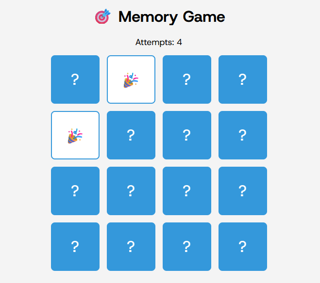

# 🎯 Memory Game

A simple **memory card matching game** built with **HTML, CSS, and JavaScript**.
Flip the cards to find matching pairs. The game tracks your number of attempts and alerts you when you win.

---

## 🚀 Features
- Smooth flip animation using CSS `rotateY`.
- Emoji-based cards (easy to replace with images).
- Tracks attempts in real-time.
- Automatic win detection and restart.
- Prevents flipping more than two cards at a time.

---

## 📂 Project Structure
```
memory-game/
│── index.html      # Main game layout
│── style.css       # Styling and animations
│── script.js       # Game logic
│── README.md       # Documentation
```

---

## 💻 How to Run
1. **Download or clone** this repository.
2. Open `index.html` in your browser.
3. Start flipping cards and matching pairs.

---

## 🎨 Customization
- **Change card icons:** Edit the `emojis` array in `script.js`.
- **Change grid size:** Adjust `grid-template-columns` in `.game-board` inside `style.css`.
- **Use images instead of emojis:** Replace the emoji HTML with `` tags.

---

## 🖼 Screenshot


---

## 📜 License
This project is open-source and free to use.
